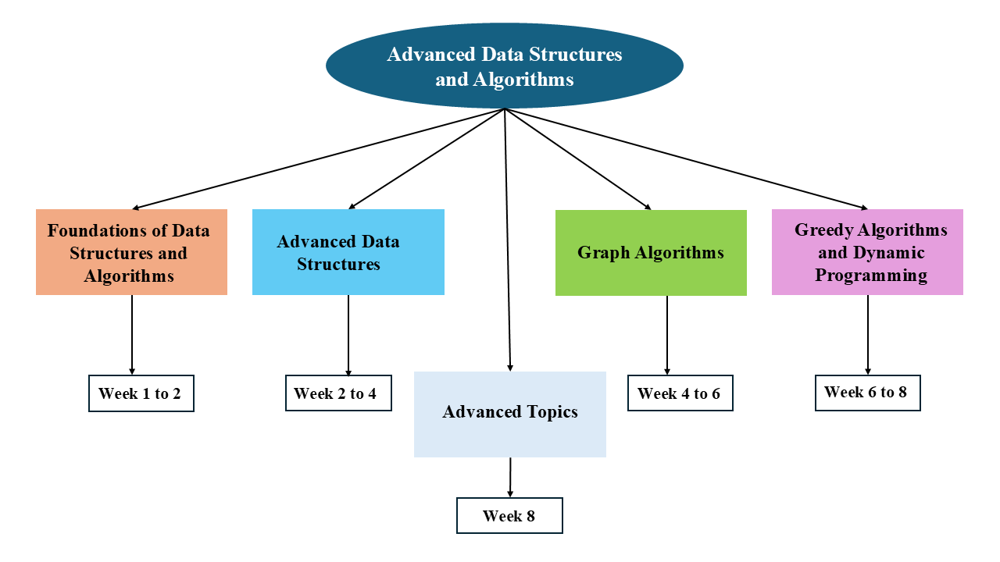

# Syllabus

--- 

Here’s the **week-wise** breakdown of the topics covered:

### Week 1: Python Revision and Sorting Algorithm
  
  - **[Bubble Sort](docs/week-1/bubble-sort.md)**
  - **[Insertion Sort](docs/week-1/insertion-sort.md/)**

### Week 2: Analysing Programs
  - **[Binary Heap](docs/week-2/Binary_Heap.md)**
  - **[Heapsort](/docs/getting-started/week_2.md)**
  - **[Analysing Computation Time](/docs/week-2/analysing-computation-time/)**

 ### Week 3: Divide and Conquer
  - **[Divide and Conquer](/docs/week-3/divide-and-conquer/)**
  - **[Merge Sort](/docs/week-3/merge-sort/)**
  
  ---

### 💡 Need Help?
Check out our **[FAQs](/docs/faqs/)** for common questions.  
Have feedback? **[Open an issue on GitHub](https://github.com/Data-cloud02/data-cloud/issues)**.  

🔗 **Want to contribute?** Fork our repo and submit pull requests to help improve **Data-Cloud**! 🚀
